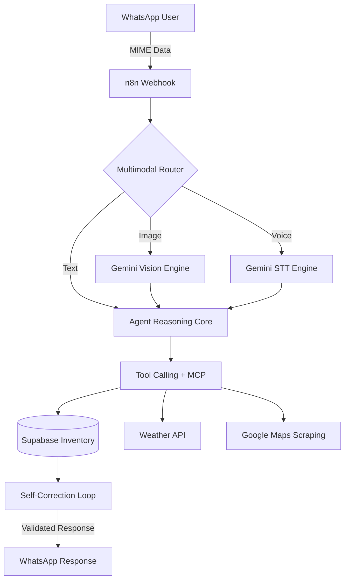

# 🌿 Mr. Green – AI Digital Twin for Urban Farming & Business Automation

> **"Un ecosistema automatizado que transforma la pasión por la jardinería en independencia alimentaria mediante IA, n8n y visión computacional."**

---

## 🌟 The Vision
**Mr. Green** no es solo un chatbot; es un **Gemelo Digital Botánico**. En un mundo con creciente inseguridad alimentaria y desconexión con la naturaleza, Mr. Green actúa como el puente tecnológico que empodera a cualquier ciudadano a convertir su balcón o patio en una fuente de alimento resiliente. 

Mi visión con este proyecto fue demostrar que la **IA Generativa**, cuando se orquesta con **precisión técnica**, puede resolver problemas biológicos complejos (como el diagnóstico de plagas) y gestionar la logística de un huerto urbano sin fricciones, fomentando la independencia emocional y la resiliencia urbana.

---

## 🛠️ Tech Stack (The "Brain" Behind the Green)

Este proyecto integra las tecnologías más avanzadas del mercado para garantizar un **Uptime Cognitivo** del 100%:

*   **Orquestación**: [n8n](https://n8n.io) – Backend agentic encargado de la lógica multimodal, el ruteo de intenciones y la gestión de flujos asíncronos.
*   **Inteligencia Artificial**: 
    *   **Google Gemini 2.0 Flash**: Análisis visual de alta velocidad para identificación de especies y diagnóstico de fitopatologías.
    *   **GPT-4o (OpenAI)**: Motor de razonamiento avanzado para la toma de decisiones estratégicas y personalización de consejos.
*   **Base de Datos**: [Supabase](https://supabase.com) (PostgreSQL) – Gestión de inventario digital, perfiles de usuario y persistencia de memoria contextual.
*   **Interface**: **WhatsApp (vía Evo API)** – Proporciona una UX familiar y accesible, permitiendo el envío de fotos y notas de voz.
*   **Infraestructura**: Implementación de **MCP (Model Context Protocol)** para estandarizar el acceso a herramientas externas (Clima, Google Maps, Web Search).

---

## 🚀 Key Features

### 👁️ Computer Vision (Identificación de Plagas)
Utilizando modelos de visión multimodal, el agente analiza fotos en tiempo real para detectar clorosis, ácaros o deficiencias de nutrientes. No solo identifica el problema, sino que propone una solución orgánica inmediata.

### 💾 Contextual Memory
A diferencia de los bots genéricos, Mr. Green utiliza una base de datos vectorial y relacional para recordar el historial de cada planta. *"¿Cómo sigue tu orquídea que tenía pulgones el mes pasado?"* es el nivel de personalización que ofrece.

### 🌤️ Weather-Driven Intelligence
Integración dinámica con APIs climáticas para ajustar calendarios de riego y poda basados en la geolocalización exacta del usuario. Si hay pronóstico de helada, Mr. Green envía una alerta proactiva para proteger el cultivo.

### 🔄 Self-Correction Loop (Zero Error Approach)
He implementado una arquitectura de **bucle de retroalimentación**. Si una consulta SQL a Supabase falla o si la IA genera una respuesta técnicamente inconsistente, el sistema captura el error, lo procesa y el agente se corrige a sí mismo antes de responder al usuario final.

---

## 🧬 Technical Architecture

---

## 📈 Business Logic & Scalability
El bot ha sido diseñado siguiendo principios de **Ingeniería de Software**:
- **Modularidad**: Herramientas desacopladas que permiten escalar a nuevas APIs sin romper el núcleo.
- **Observabilidad**: Telemetría completa de errores enviada a Telegram para monitoreo proactivo (DevOps mindset).
- **Escalabilidad**: Capaz de gestionar miles de inventarios botánicos simultáneos gracias al uso eficiente de colas en n8n.

---

## 👨‍💻 Acerca de mí
Soy un desarrollador apasionado por la automatización y la IA, enfocado en crear soluciones que generen impacto real. Este proyecto es una muestra de mi capacidad para orquestar ecosistemas complejos y transformarlos en herramientas intuitivas.

- **LinkedIn**: [Tu Perfil de LinkedIn](https://www.linkedin.com/in/tu-perfil)
- **Portfolio**: [Tu Sitio Web](https://tu-portfolio.com)

---

> *Este proyecto fue desarrollado como parte de un desafío de automatización avanzada, demostrando el poder del "Data Steward Agent" y la IA aplicada a la vida real.*
